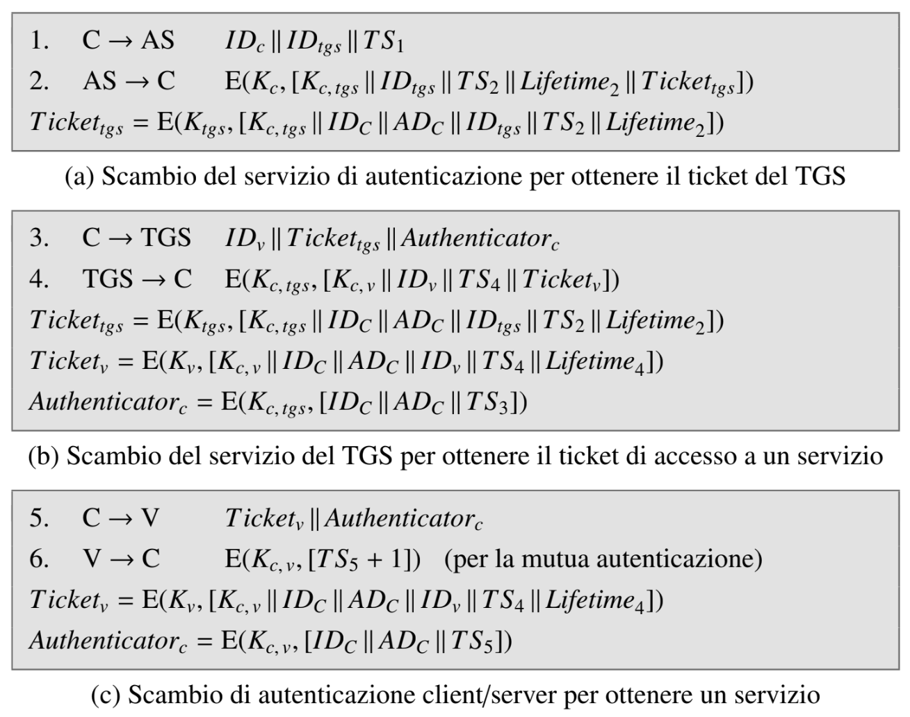

# Simple Kerberos Implementation
A simple implementation of kerberos essentials features as project for the practical part of the exam of Information Security of University of Bologna (Sicurezza dell'Informazione M) which follows what was covered in the course.

The project has been developed in go mainly because I wanted to try this language in a concrete sitation, but also because it's a good programming language for low level and it's suitable for implementing protocols.

# Run The Application
NOTE: since it's a demo project the Administrator password is always `admin`
\
\
To run kerberos: `make run-kerberos`
\
To run client: `make run-client SERVERIP=<ip> CMD=<command>`
\
To run service: `make run-service ID=<serviceId> SERVICEIP=<ip> SERVICEPORT=<port>`
\
To configure AS: `make run-asconfig CMD=<cmd>`
\
To configure TGS: `make run-tgsconfig TGSNAME=<name> CMD=<cmd>`
\
To build everything (without run): `make build`

# The Protocol
The messages exchange implemented follows quite completely the below structure of original Kerberos messages with just two differences

- When sending a ticket, the AS or TGS server put the lifetime of the ticket also in the part encrypted only with the key shared with the client. In this way there is no risk because the lifetime is still included in the ticket as well (so the server can trust the received lifetime), but makes easier to the client the client know when its ticket is expired
- To avoid possible attacks to the criptographic implementation choices descripted in the next section, every encrypted message and ticket has been authenticated with a Encrypt-then-MAC schema, so the necessary MACs have been added to the messages

# Implementation Choices
At the cryptographic level, the following choices have been made:

- the go criptographically secure PRNG (library "crypto/rand") has been used to generate symmetric keys and IVs
- symmetric keys dimension: 128 bit
- symmetric encryption algorithm: AES with CBC mode (so message integrity and authentication are needed to prevent possible attacks to CBC)
- block padding: the simple PKCS#7 padding has been used (to prevent possible attacks such as padding oracle attack, integrity and authentication of the message is required)
- MAC algorithm: SHA256 with Encrypt-then-MAC schema.
- password derived key: PBKDF2 with SHA256 has been used to derive the user-AS key from user's password

To store the data, the following choices have been made:
- Client data: the client only need to store TGS and service tickets with their related data. For semplicity they are stored in a local non-encrypted sqlite relational db in two simple tables, because in this case data are retrieved locally and are temporary
- AS data: the AS needs to store client data (client ID and password generated key) and TGS pre-shared keys (TGS ID and relative key). In this case they are stored in an encrypted local sqlite relational db. In this simple implementation db password must be provided on server start
- TGS data: similar to AS data, in this case the TGS needs to store the pre-shared keys with AS and services. They are stored in an encrypted local db and password must be provided at server start
- Service data: the service just need to store the key shared with TGS (for semplicity, in this implementation I supposed that the service can be registered only on one TGS). The key is stored in a text file and it will have to be protected at file system level
 
Although in kerberos both TCP and UDP can be used as transport layer protocol, for semplicity only UDP has been implemented in this project 

# Short Code Documentation
In this section there is a short documentation of the main files of the project

## Runnable Files
Under the /cmd directory there are all the fail containing main which will be compiled in runnable files.

- [client/main.go](/cmd/client/main.go): start the client to perform one of the steps of the protocol
- [service/main.go](/cmd/service/main.go): start the final service
- [kerberos/main.go](/cmd/kerberos/main.go): start kerberos' servers (AS and TGSs). The main starts all the servers as goroutine: always a single AS and a list of TGSs retrieved from [config/config.go](/config/config.go)
- [asconfig/main.go](/cmd/asconfig/main.go) and [tgsconfig/main.go](/cmd/tgsconfig/main.go): these files are supposed to be utilities that help add, delete and modify cleints data and pre-shared keys stored in local AS and TGSs dbs 

## Data Structures Files
Messages are sent through the network as json string. This rappresentation makes easy marshaling and unmarshaling operations and prevent from compatibility problems. The following files contain the data structures used to convert from and to json format

- [/internal/messages/types.go](/internal/messages/types.go): contains all the data structures that model the messages structure. The three types of request (sent from the client) are modelled by ASRequest, TGSRequest and ServiceRequest, while for the replies there is a Reply structure which is supposed to contain the encrypted data, the mac and a flag to set in case of error. ServiceReply will be the payload of the reply of the service (which will fit into the data field of Reply once marshaled and encrypted)
- [/internal/dto/types.go](/internal/messages/types.go): contains all the data structure that rappresent Ticket, Authenticator and rows of the db. TicketData contains all the data that AS or TGS will send with the ticket to the client (the ones the client can read once decrypted). This is a single data structure for both AS and TGS reply because the two messages contain the same types of information (the filed TargetId can contain the TGS ID or the service ID)

## Criptographic Files
In [/internal/security/crypto.go](/internal/security/crypto.go) there are all the methods that perform all the necessary criptographic operations already describde.

## Data Access Related Files
Under [/internal/dao](/internal/dao) there are all the files which contains functions that allow to access the dbs to perform all the operations on data like: retrieve ticket and their related data, store a new ticket received or delete an expired one for the client or register a user or a service or retrieve keys for AS and TGS

## Protocol Files
The files under the /internal/protocol contains the logic of the kerberos protocol for each entity. They implement the core of the kerberos protocol using the modules above to recieve and build messages and reply, encrypt/decrypt and check authenticity, access the db to retrieve, store or check data:
- [client.go](/internal/protocol/client.go)
- [as.go](/internal/protocol/as.go)
- [tgs.go](/internal/protocol/tgs.go)
- [service.go](/internal/protocol/service.go)

